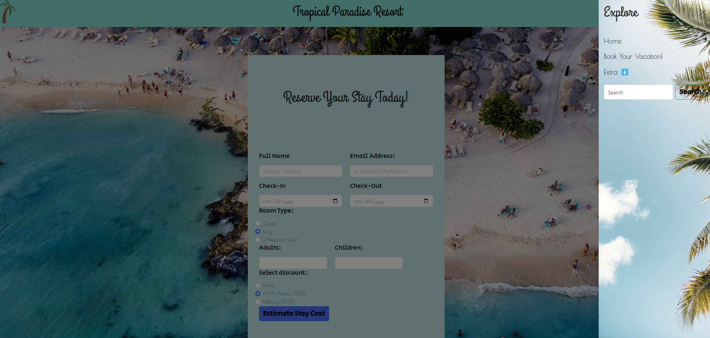
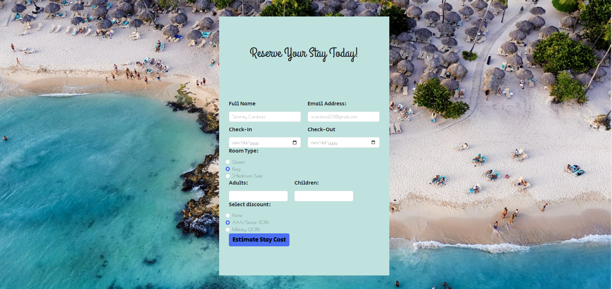

UPDATED: 9/12/2023

This is a sample resort website with a reservations page. You are able to view three pictures on the carousel with a brief explanation of the resort in the index page.

This page comes complete with a navbar that has a palm tree background to match the tropical theme. As of now, the only working page is the reservations. You are able to enter all of your information and click the submit button to get an estimate of the cost of your stay. You may have discounts applied depending on the option you choose. 

This is my first project where I have added JS!

Coming Soon: Adding more working pages (you will be able to click and navigate through various pages giving the site more interactiveness)

Preview:

Index: 
Navbar: 
Reservation: 